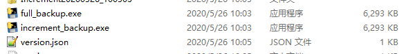
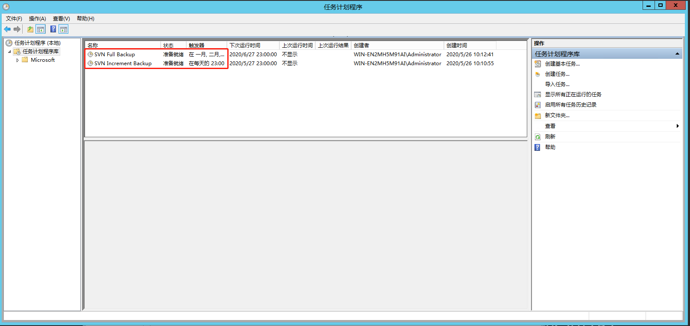

# SVN备份
> **作者**：Dawn  
> **语言**：Python  
> **概述**：本项目主要用于==SVN全量备份和增量备份==，所用命令为`svnadmin dump`。代码中使用的是DOS命令，因此主要用于Windows系统，通过在任务计划程序中创建任务定时启动程序实现定时备份。
> 

### 使用步骤 
STEP1：修改`full_backup.py`，`increment_backup.py`文件中的参数  
- SVN根目录：SVN_ROOT  
- 仓库根目录：REPO_ROOT  
- 备份根目录：BACKUP_ROOT  

STEP2：修改`version.json`文件中的需要备份的库名，如果是第一次增量备份，则将版本号改为-1，如果之前进行过增量备份，则将版本号改为上次增量备份的最新版本号。`version.json`文件用于记录增量备份时当前已备份的库的版本信息。  
```
{
    "Repo1": -1,
    "Repo2": -1,
    "Repo3": -1
}
```

STEP3：通过`pyinstaller -F full_backup.py` `pyinstaller -F increment_backup.py`命令将python文件打包成exe文件。如果缺少pyinstaller库可以通过`pip install pyinstaller`命令安装。  

STEP4：将打包后的exe文件和`version.json`文件放入SVN所在服务器上备份根目录中。  


STEP5：在任务计划程序中创建任务，并将启动程序选为打包后的exe文件。任务创建好后，每次在设定的时间，服务器就会自动进行全量备份和增量备份。  

